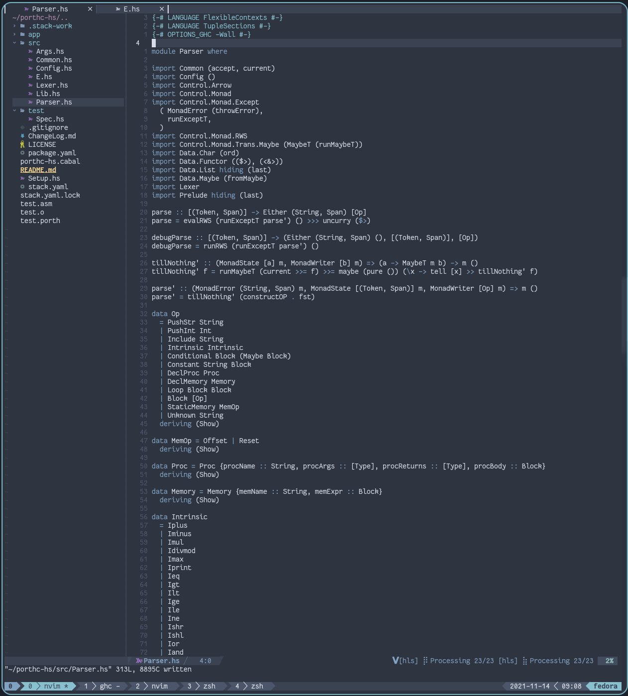

# Neovim in Lua

I've taken the opportunity to rewrite my config in Lua, therefore
cleaning it up. Using this opportunity to learn a bit of fennel, a
lisp-like lua, I've written all my configuration in this language, and
all the config is under [`fnl/`](./fnl), the stuff in [`main.lua`](./lua/main.lua) has been compiled via the `fennel` tool
and the [`makefile`](./makefile) that you can see.

Everything is compiled into the `main.lua` to avoid dangling files (configs from plugins I no longer use) and minimize the work needed
to load everything, as no new files have to be open and parsed in order to load them.

Fennel is very readable even if you don't really know how to write it, so if you want
to take inspiration of my config, you will have no problem on reading it, just don't take the
brackets into account.

# Dependencies

The only dependency here is `neovim` version `0.5+`.
